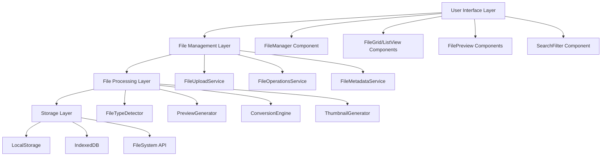

# Design Document

## Overview

The Universal File Manager will transform the existing PDF conversion application into a comprehensive file management system that supports all file types with an enhanced, modern UI. The design leverages the existing React + TypeScript + Tailwind CSS stack while introducing new components for file handling, preview generation, and multi-format support.

The architecture will maintain the current clean separation of concerns while expanding capabilities to handle diverse file types including documents, images, videos, audio, archives, and code files. The enhanced UI will provide intuitive file management with drag-and-drop, grid/list views, search/filtering, and responsive design.

## Architecture

### High-Level Architecture



### Component Hierarchy

```
App
├── Header (enhanced)
├── FileManager (new main container)
│   ├── FileUploadZone (enhanced from FileUpload)
│   ├── FileToolbar (new - search, filters, view toggle)
│   ├── FileGrid (new - grid view)
│   ├── FileList (new - list view)
│   └── FilePreviewModal (new - detailed preview)
├── FileOperationsPanel (new - bulk operations)
└── NotificationSystem (new - progress/status)
```

## Components and Interfaces

### Core Interfaces

```typescript
interface FileItem {
  id: string;
  name: string;
  size: number;
  type: string;
  mimeType: string;
  lastModified: Date;
  uploadDate: Date;
  content?: string | ArrayBuffer;
  thumbnail?: string;
  metadata?: FileMetadata;
  tags?: string[];
}

interface FileMetadata {
  dimensions?: { width: number; height: number };
  duration?: number; // for audio/video
  pages?: number; // for documents
  encoding?: string; // for text files
  compression?: string; // for archives
  [key: string]: any;
}

interface FileOperation {
  id: string;
  type: 'upload' | 'convert' | 'delete' | 'download';
  fileId: string;
  progress: number;
  status: 'pending' | 'processing' | 'completed' | 'error';
  error?: string;
}

interface ViewSettings {
  layout: 'grid' | 'list';
  sortBy: 'name' | 'size' | 'type' | 'date';
  sortOrder: 'asc' | 'desc';
  filterBy: {
    type?: string[];
    dateRange?: { start: Date; end: Date };
    sizeRange?: { min: number; max: number };
  };
  searchQuery: string;
}
```

### Enhanced FileUploadZone Component

Extends the current FileUpload component to support all file types:

- Remove file type restrictions
- Add support for multiple file uploads
- Implement file type detection
- Add progress tracking for large files
- Support folder uploads via webkitdirectory

### FilePreview Components

Specialized preview components for different file types:

- **ImagePreview**: Thumbnail generation, zoom, rotation
- **VideoPreview**: Thumbnail extraction, basic playback controls
- **AudioPreview**: Waveform visualization, playback controls
- **DocumentPreview**: Text extraction, page thumbnails
- **CodePreview**: Syntax highlighting, line numbers
- **ArchivePreview**: Contents listing, extraction options
- **GenericPreview**: File icon, metadata display

### FileGrid and FileList Components

Two view modes for file display:

- **Grid View**: Card-based layout with large thumbnails
- **List View**: Table-like layout with detailed metadata
- Responsive design adapting to screen size
- Virtual scrolling for performance with many files
- Selection support for bulk operations

### FileOperationsPanel Component

Handles file operations and conversions:

- Bulk selection and operations
- Conversion options based on file types
- Progress tracking for operations
- Queue management for multiple operations

## Data Models

### File Storage Strategy

```typescript
class FileStorageManager {
  // Use IndexedDB for file metadata and small files
  private metadataDB: IDBDatabase;
  
  // Use File System Access API for large files (when available)
  private fileSystemAPI?: FileSystemDirectoryHandle;
  
  // Fallback to memory/blob URLs for unsupported browsers
  private memoryStorage: Map<string, Blob>;
  
  async storeFile(file: File): Promise<FileItem>;
  async retrieveFile(id: string): Promise<FileItem | null>;
  async deleteFile(id: string): Promise<boolean>;
  async listFiles(filter?: FileFilter): Promise<FileItem[]>;
}
```

### File Type Detection

```typescript
class FileTypeDetector {
  static detectType(file: File): FileType {
    // Primary: Use file extension
    // Secondary: Use MIME type
    // Tertiary: Use magic number detection for binary files
  }
  
  static getSupportedOperations(fileType: FileType): Operation[];
  static getPreviewType(fileType: FileType): PreviewType;
}
```

## Error Handling

### File Upload Errors

- File size limits (configurable, default 100MB)
- Unsupported file types (graceful degradation)
- Network errors during upload
- Storage quota exceeded
- Corrupted file detection

### Preview Generation Errors

- Fallback to generic file icon
- Error state display with retry option
- Timeout handling for large files
- Memory management for large previews

### Conversion Errors

- Clear error messages with suggested solutions
- Retry mechanisms for transient failures
- Progress indication with cancellation support
- Partial success handling for batch operations

## Testing Strategy

### Unit Tests

- File type detection accuracy
- Preview generation for various formats
- File operation state management
- Search and filtering logic
- Storage operations (mocked)

### Integration Tests

- End-to-end file upload flow
- File conversion workflows
- UI component interactions
- Responsive design behavior
- Performance with large file sets

### Performance Tests

- File upload performance with various sizes
- Preview generation speed
- Memory usage with many files
- Virtual scrolling performance
- Search/filter response times

### Browser Compatibility Tests

- File System Access API fallbacks
- IndexedDB operations across browsers
- Drag and drop functionality
- Mobile touch interactions
- Progressive enhancement features

## Implementation Phases

### Phase 1: Core Infrastructure
- Enhanced file upload with multi-file support
- Basic file storage and retrieval
- File type detection system
- Updated UI layout and navigation

### Phase 2: Preview System
- Image preview with thumbnails
- Document text extraction
- Video/audio metadata extraction
- Generic file preview fallbacks

### Phase 3: File Operations
- File management operations (delete, rename)
- Basic conversion system (extend PDF generation)
- Search and filtering functionality
- Bulk operations support

### Phase 4: Enhanced UI/UX
- Grid and list view implementations
- Advanced filtering and sorting
- Progress tracking and notifications
- Mobile responsiveness improvements

### Phase 5: Advanced Features
- Archive file handling
- Code syntax highlighting
- Advanced conversion options
- Performance optimizations